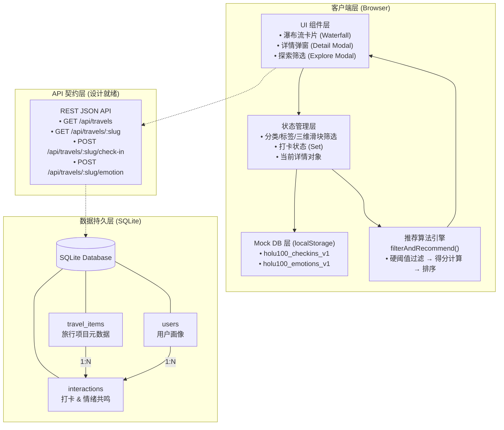

# 100种不可思议旅行

> 地球上尚未被广泛看见的瞬间，正在等待你的目光。

---

## 项目简介与核心价值主张

**100种不可思议旅行** 是一款面向 Z 世代、反常规旅行者与视觉猎人的小众旅行发现产品。我们不推荐「此生必去」的热门打卡地，而是挖掘地球上那些尚未被广泛看见的瞬间——需要穿越熔岩荒原才能抵达的冰岛蓝火山温泉、悬在大西洋之上的法罗群岛悬湖、地下三百米由巨型水晶构成的墨西哥水晶洞。

### 核心价值主张

| 维度 | 传统旅行平台 | 100种不可思议旅行 |
|------|-------------|------------------|
| 内容取向 | 热门景点、流量导向 | 极致小众、反打卡 |
| 用户互动 | 收藏、评分 | **打卡** + **情绪共鸣** |
| 推荐逻辑 | 销量/热度排序 | 多维度匹配（冷门度 × 视觉 × 治愈 × 情绪标签） |
| 情绪价值 | 攻略工具 | 精神共鸣与渴望感 |

### 目标人群画像

- **Z 世代**：拒绝被定义，追求独特的社交货币
- **反常规者**：刻意避开网红景点，以「去没人去的地方」为荣
- **视觉猎人**：用眼睛收集世界的高光时刻，对画面构图有极致追求

---

## 系统技术选型说明

### 前端层

| 技术 | 用途 | 选型理由 |
|------|------|----------|
| **原生 HTML5 + ES Module** | 页面结构与逻辑 | 零构建工具依赖，面试官一行命令即可运行，无 node_modules 黑洞 |
| **Tailwind CSS (CDN)** | 样式系统 | 原子化 CSS，快速实现深色沉浸式 UI，无需配置构建链 |
| **原生 JavaScript** | 交互逻辑 | 直接操作 DOM，无框架抽象层，逻辑透明可控 |
| **localStorage** | 前端数据持久化（MVP 阶段） | 模拟数据库写入，打卡与共鸣状态刷新不丢失 |

### 算法层

| 技术 | 用途 | 选型理由 |
|------|------|----------|
| **原生 JavaScript** | 推荐与筛选引擎 | 独立可测试的纯函数 `filterAndRecommend`，零外部依赖 |
| **Node.js 内置 `node:test`** | 单元测试 | 零依赖测试框架，TDD 红绿循环 |

### 数据层（设计就绪）

| 技术 | 用途 | 选型理由 |
|------|------|----------|
| **SQLite** | 关系型数据持久化 | 轻量、零配置、单文件即可迁移，与 Node/Bun/Deno 原生兼容 |
| **JSON (TEXT)** | 数组/对象字段存储 | 与 SQLite 原生兼容，应用层解析，避免过度范式化 |

---

## 系统架构图



### 数据流转说明

1. **初始化阶段**：`app.js` 加载时，从 `localStorage` 恢复用户的打卡记录与情绪共鸣数据；若首次访问，将 seed 数据写入 `localStorage`
2. **浏览阶段**：6 条旅行项目以瀑布流形式渲染，支持分类快捷筛选与三维探索筛选（小众度 / 视觉 / 治愈）
3. **筛选阶段**：用户调整滑块或选择标签 → `filterAndRecommend` 算法执行硬阈值过滤 + 多维度加权得分计算 → 结果按匹配度降序重排
4. **互动阶段**：用户点击「打卡」→ 写入 `localStorage` + 更新按钮状态 + 计数器 +1；用户发表「情绪共鸣」→ 写入对应项目的共鸣列表 + 实时插入 DOM + 计数器 +1
5. **持久化阶段**：页面刷新后，`DB.getCheckIns()` 与 `DB.getEmotions()` 从 `localStorage` 恢复状态，打卡按钮保持「已打卡」，共鸣列表保留用户发表的内容

---

## 本地一键启动与运行指南

### 前置要求

- [Node.js](https://nodejs.org/) >= 18（用于运行测试）
- 任意现代浏览器（Chrome / Safari / Firefox / Edge）

### 方式一：Python 极速启动（推荐，无需 Node）

```bash
# 进入项目目录
cd Holu100-travel

# Python 3
python3 -m http.server 8080

# 浏览器打开
open http://localhost:8080
```

### 方式二：Node.js 启动

```bash
# 进入项目目录
cd Holu100-travel

# 使用 npx serve（无需安装）
npx serve -p 8080

# 或使用全局 http-server
npm install -g http-server
http-server -p 8080
```

### 方式三：VS Code Live Server

在 VS Code 中安装 [Live Server](https://marketplace.visualstudio.com/items?itemName=ritwickdey.LiveServer) 插件，右键 `index.html` → **Open with Live Server**。

### 运行推荐算法测试

```bash
# TDD 测试套件（零依赖，Node.js 内置 test runner）
node --test recommend.test.js
```

预期输出：

```
▶ filterAndRecommend
  ✔ 应按 minRarity 硬阈值正确过滤项目 (1.234ms)
  ✔ targetRarity 越接近的项目应排在越前面 (0.567ms)
  ✔ 包含用户偏好情绪标签的项目应获得更高得分 (0.789ms)
  ✔ 应支持多维度加权综合排序 (0.456ms)
  ✔ 极端条件下应返回空数组且不崩溃 (0.234ms)
  ✔ 未传 weights 时应使用默认权重正常计算 (0.345ms)
  ✔ 应正确处理 targetRarity 的边界值 1 和 10 (0.678ms)
  ✔ emotionTags 为空数组时不应崩溃且 emotionScore 为 0 (0.234ms)
  ✔ 所有结果的 score 应在 0-100 范围内 (0.456ms)
  ✔ 应生成人类可读的 matchReasons (0.567ms)
▶ filterAndRecommend (10 tests)

ℹ tests 10
ℹ suites 1
ℹ pass 10
ℹ fail 0
```

---

## 项目目录结构

```
Holu100-travel/
├── index.html              # 单页应用入口（HTML 结构 + Tailwind CDN）
├── app.js                  # 前端应用逻辑：状态管理、渲染、交互、localStorage 持久化
├── recommend.js            # 推荐算法核心：filterAndRecommend 纯函数
├── recommend.test.js       # TDD 测试套件（Node.js 内置 test/assert）
├── init_db.sql             # SQLite 数据库初始化脚本（表结构 + seed 数据）
├── docs/
│   ├── schema.md           # 数据库 Schema 设计文档（3 张表 + 索引 + 关系图）
│   ├── api.md              # REST API 契约文档（5 个端点 + 请求/响应示例）
│   ├── ui-components.md    # UI 组件设计文档（布局、动效、响应式策略）
│   └── tests.md            # 测试用例设计文档（10 个 TC + 算法公式）
└── README.md               # 本文件
```

---

## 核心功能演示

### 1. 瀑布流浏览

打开页面即见 6 张旅行卡片，按网格布局自适应排列（手机 1 列 / 平板 2 列 / 桌面 3 列）。每张卡片展示封面图、标题、地点、三维评分（hover 显现）。

### 2. 探索筛选

点击右上角「探索」按钮，打开筛选面板：
- **三维滑块**：小众度 / 视觉冲击力 / 治愈度（1-10）
- **分类快捷**：全部 / 景观 / 艺术 / 冒险 / 治愈
- **标签云**：点击标签进行多选匹配

点击「应用筛选」后，推荐算法实时计算匹配度并重新排序。

### 3. 打卡互动

点击任意卡片进入详情页，点击「打卡」按钮：
- 按钮变为「✓ 已打卡」状态（金色边框 + 不可重复点击）
- 打卡人数 +1
- **刷新页面后，打卡状态仍然保留**（localStorage 持久化）

### 4. 情绪共鸣

在详情页底部的共鸣输入框中写下感受，选择情绪标签（震撼 / 治愈 / 启发 / 渴望 / 苍凉），点击「发布」：
- 你的共鸣实时插入列表顶部，标记为「刚刚」
- **刷新页面后，共鸣内容仍然保留**（按项目独立存储在 localStorage）

---

## 设计文档索引

| 文档 | 内容 | 路径 |
|------|------|------|
| 数据库 Schema | 3 张表结构、字段约束、索引策略、关系图 | `docs/schema.md` |
| API 契约 | 5 个 REST 端点、请求参数、响应格式、错误码 | `docs/api.md` |
| UI 组件 | 响应式布局、卡片动效、弹窗交互、颜色系统 | `docs/ui-components.md` |
| 测试设计 | 10 个测试用例、输入输出、断言、算法公式 | `docs/tests.md` |

---

## 技术亮点

- **零构建工具**：无 Webpack / Vite / Parcel，原生 ES Module 直接运行，降低理解成本
- **TDD 驱动算法**：先写 10 个测试用例，再实现 `filterAndRecommend`，红绿循环验证正确性
- **localStorage 模拟数据库**：MVP 阶段即实现完整的 CRUD 模拟，打卡与共鸣数据刷新不丢失
- **深色沉浸式 UI**：自研设计系统（deep/card/elevated 三层色阶 + amber/cyan/rose 三色强调），Tailwind 原子类实现，无自定义 CSS 框架依赖
- **响应式弹窗**：桌面端居中缩放动画，移动端底部滑入，同一套 DOM 两种交互范式

---

## 未来迭代方向

1. **后端接入**：将 localStorage 层替换为真实的 SQLite + Node.js/Bun REST API，实现多用户并发
2. **用户系统**：接入微信 OAuth，完成 `users` 表与 `interactions` 表的真实关联
3. **地图可视化**：利用 `coordinates` 字段在详情页嵌入地图组件，展示旅行目的地精确位置
4. **社交图谱**：基于 `user_follows` 表扩展关注关系，打造「同类旅行者」发现机制

---

*Made with curiosity for the unseen world.*
