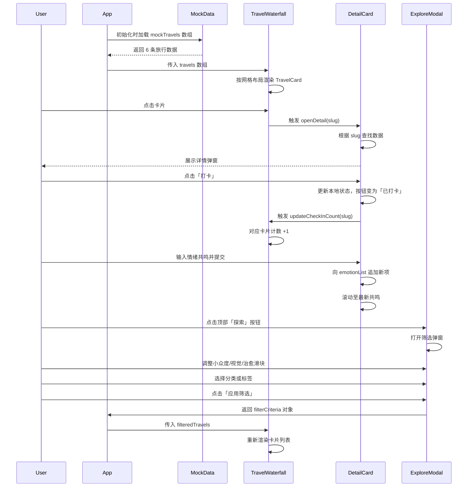

# 100种不可思议旅行 — 前端组件规划文档

> 设计原则：深色情绪画布 + 大留白 + 高对比度影像 + 极简交互。每一个组件都服务于「让用户在 0.3 秒内产生视觉震撼」这一目标。

---

## 技术栈选型

| 层级 | 技术 | 说明 |
|------|------|------|
| 构建工具 | **无** | 零配置，双击 `index.html` 即可运行 |
| 框架 | **Vanilla JavaScript (ES6+)** | 无框架依赖，单文件逻辑，学习成本最低 |
| 样式 | **Tailwind CSS (CDN)** | Utility-first，响应式前缀开箱即用，gzip 后约 27KB |
| 字体 | **Noto Sans SC (Google Fonts)** | 中文显示优雅，字重 300/400/700 三级 |
| 图标 | **内联 SVG** | 零额外请求，尺寸可控，支持 CSS 着色 |

**选型理由**：本项目处于 MVP 验证阶段，核心诉求是「快速展示、随时可跑、视觉出片」。Vite+React 虽强，但需要 Node.js 环境和构建步骤，对非技术背景的协作者不友好。纯 HTML+JS+Tailwind CDN 方案在保持现代感的同时，实现了「复制文件到任何电脑都能打开」的极致轻量。

---

## 色彩系统（情绪画布）

| Token | 色值 | 用途 |
|-------|------|------|
| `bg-deep` | `#0B0F19` | 页面深层背景 |
| `bg-card` | `#111827` | 卡片背景 |
| `bg-elevated` | `#1F2937` | 弹窗/浮层背景 |
| `text-primary` | `#F9FAFB` | 主标题、重要文字 |
| `text-secondary` | `#9CA3AF` | 正文、描述 |
| `text-muted` | `#6B7280` | 辅助信息、时间戳 |
| `accent-amber` | `#F59E0B` | 治愈度、温暖情绪、CTA 高亮 |
| `accent-cyan` | `#06B6D4` | 小众度、冷静深邃感 |
| `accent-rose` | `#F43F5E` | 视觉冲击力、情绪峰值 |
| `border-subtle` | `rgba(255,255,255,0.06)` | 卡片边框、分割线 |

---

## 组件树（Component Tree）

```mermaid
graph TD
    App[App 根容器]
    App --> Navbar[Navbar 导航栏]
    App --> Hero[HeroSection 情绪首屏]
    App --> FilterBar[FilterBar 快速筛选栏]
    App --> Waterfall[TravelWaterfall 旅行瀑布流]
    App --> DetailCard[DetailCard 详情弹窗]
    App --> ExploreModal[ExploreModal 探索筛选弹窗]

    Navbar --> Brand[BrandLogo 品牌标识]
    Navbar --> NavActions[NavActions 探索按钮]

    Hero --> Headline[Headline 大标题]
    Hero --> Subtitle[Subtitle 情绪副标题]

    FilterBar --> FilterChip[FilterChip 筛选标签 × N]

    Waterfall --> TravelCard[TravelCard 旅行卡片 × N]
    TravelCard --> CardImage[CardImage 封面图]
    TravelCard --> CardOverlay[CardOverlay 渐变遮罩]
    TravelCard --> CardTags[CardTags 标签胶囊]
    TravelCard --> CardMeta[CardMeta 三维评分]
    TravelCard --> CardTitle[CardTitle 标题]

    DetailCard --> ModalBackdrop[ModalBackdrop 暗色遮罩]
    DetailCard --> DetailContent[DetailContent 内容区]
    DetailContent --> DetailHeader[DetailHeader 封面图+关闭]
    DetailContent --> DetailBody[DetailBody 正文+画廊]
    DetailContent --> DetailScores[DetailScores 评分展示]
    DetailContent --> ActionBar[ActionBar 打卡按钮]
    DetailContent --> EmotionSection[EmotionSection 情绪共鸣区]
    EmotionSection --> EmotionForm[EmotionForm 输入框]
    EmotionSection --> EmotionList[EmotionList 共鸣列表]
    EmotionList --> EmotionItem[EmotionItem 单条共鸣]

    ExploreModal --> ExploreBackdrop[ModalBackdrop 暗色遮罩]
    ExploreModal --> ExploreContent[ExploreContent 内容区]
    ExploreContent --> ScoreSliders[ScoreSliders 三维滑块]
    ExploreContent --> CategorySelector[CategorySelector 分类选择]
    ExploreContent --> TagCloud[TagCloud 标签云]
    ExploreContent --> ApplyButton[ApplyButton 应用筛选]
```

---

## 数据流图（Data Flow）

---

## 各组件职责与 Props

### Navbar
- **职责**：品牌锚定 + 全局入口触发
- **固定**：`position: fixed`，滚动时背景从透明渐变为半透明毛玻璃
- **Props**：无（纯展示）
- **事件**：点击「探索」按钮 → 触发 `openExploreModal()`

### HeroSection
- **职责**：3 秒内建立情绪基调
- **内容**：大字标题「100 种不可思议旅行」+ 副标题「地球上尚未被广泛看见的瞬间」
- **动画**：文字 `opacity` 从 0 → 1，`translateY` 从 20px → 0，持续 1.2s，ease-out
- **Props**：无

### FilterBar
- **职责**：提供高频筛选的快捷入口，减少用户操作路径
- **标签**：全部 / 景观 / 艺术 / 冒险 / 治愈
- **交互**：点击切换激活态，即时过滤瀑布流内容
- **Props**：`activeFilter: string`, `onFilterChange: (filter) => void`

### TravelWaterfall
- **职责**：核心内容展示区，采用 CSS Grid 响应式网格
- **布局**：`grid-cols-1 md:grid-cols-2 lg:grid-cols-3`，gap 16px
- **Props**：`travels: TravelItem[]`
- **子组件**：`TravelCard`

### TravelCard
- **职责**：单条旅行信息的视觉容器，追求「一图胜千言」
- **结构**：封面图（`aspect-[4/5]`，全覆盖）→ 底部渐变遮罩 → 标题 + 标签 + 三维评分
- **Hover**：图片 `scale(1.05)`，过渡 0.5s；遮罩渐变加深；评分数字从隐藏变为显示
- **Props**：`travel: TravelItem`
- **事件**：`onClick` → 打开 DetailCard

### DetailCard（Modal）
- **职责**：沉浸式详情阅读 + 互动操作
- **进入动画**：从底部滑入（移动端）/ 居中缩放淡入（桌面端）
- **结构**：
  - 顶部：全宽封面图（`aspect-video`）+ 关闭按钮
  - 正文：标题 + 地点 + 正文描述 + 画廊横向滚动
  - 评分：三个维度以进度条可视化展示
  - 操作：「打卡」主按钮 + 「情绪共鸣」次级按钮
  - 共鸣区：已有共鸣列表 + 输入框
- **Props**：`travel: TravelItem`, `isOpen: boolean`, `onClose: () => void`

### ExploreModal（Modal）
- **职责**：精细化内容发现，满足「反常规生活方式追求者」的挑剔口味
- **结构**：
  - 小众度滑块（1-10）
  - 视觉冲击力滑块（1-10）
  - 治愈度滑块（1-10）
  - 分类单选组
  - 热门标签云（多选）
  - 「应用筛选」主按钮
- **Props**：`isOpen: boolean`, `filters: FilterState`, `onApply: (filters) => void`, `onClose: () => void`

---

## 响应式断点策略

| 断点 | 宽度 | 布局调整 |
|------|------|----------|
| `sm` | ≥640px | 瀑布流改为 2 列，卡片标题字号放大 |
| `md` | ≥768px | Hero 标题使用 `text-5xl`，FilterBar 横向展开 |
| `lg` | ≥1024px | 瀑布流 3 列，DetailCard 以居中弹窗形式呈现（非全屏） |
| `xl` | ≥1280px | 最大内容宽度限制为 `1280px`，两侧留白增加呼吸感 |

---

## 交互动效规范

| 场景 | 动效 | 时长 | 缓动 |
|------|------|------|------|
| 页面加载 | 卡片 stagger 淡入 | 每张 0.1s 延迟 | `ease-out` |
| 卡片 Hover | 图片放大 + 遮罩加深 | 0.5s | `cubic-bezier(0.4, 0, 0.2, 1)` |
| 弹窗打开 | 遮罩淡入 + 内容滑入/缩放 | 0.3s | `cubic-bezier(0.16, 1, 0.3, 1)` |
| 弹窗关闭 | 内容滑出/缩放 + 遮罩淡出 | 0.2s | `ease-in` |
| 按钮 Hover | 背景色亮度提升 | 0.2s | `ease` |
| 筛选切换 | 卡片列表交叉淡入淡出 | 0.3s | `ease-out` |

---

## 扩展路线图

| 阶段 | 新增组件 | 说明 |
|------|----------|------|
| MVP+1 | `TravelRoute` | 将多个旅行串联成主题路线（如「北欧孤独之旅」） |
| MVP+1 | `UserProfile` | 用户个人页，展示已打卡项目和情绪共鸣历史 |
| MVP+2 | `ImageLightbox` | 画廊图片点击后全屏灯箱查看 |
| MVP+2 | `ScrollReveal` | 基于 Intersection Observer 的滚动揭示动效封装 |
